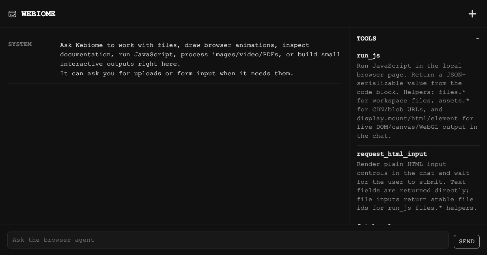

  

<h1 align="center">Webiome</h1>

  Browser-local agent workspace for files, docs, JavaScript, media processing, and live web outputs.

  

## Tools

- `run_js` runs JavaScript in the local browser page, with helpers for workspace files, blob/CDN assets, and live DOM/canvas/WebGL output.
- `request_html_input` renders ordinary HTML inputs in chat for forms, choices, and uploads.
- `fetch_url` fetches public docs or source through the Webiome Worker.
- `list_reference_docs` lists browser/WASM reference URLs.
- `grep_url` searches one explicit fetched URL.
- `page_state` reports the current session state.

## Credit

Webiome reuses the local browser agent loop from [pi.dev](https://pi.dev/) through `@earendil-works/pi-agent-core`. The app layer, browser tools, and Worker adapter live here.
