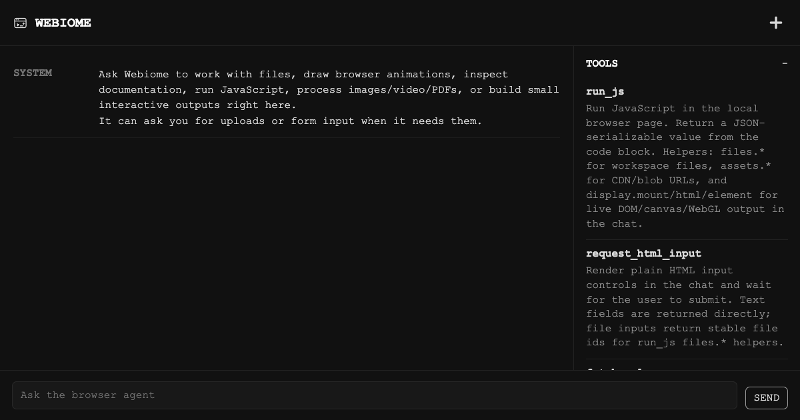

  

<h1 align="center">Webiome</h1>

Browser-local agent workspace for files, docs, JavaScript, media processing, and live web outputs.
Optionally connects to ChatGPT plan usage through OpenAI's official Sign in with ChatGPT flow.

  

## Tools

- `run_js` runs JavaScript in the local browser page, with helpers for workspace files, blob/CDN assets, and live DOM/canvas/WebGL output.
- `request_html_input` renders ordinary HTML inputs in chat for forms, choices, and uploads.
- `fetch_url` fetches public docs or source through the Webiome Worker.
- `list_reference_docs` lists browser/WASM reference URLs.
- `grep_url` searches one explicit fetched URL.
- `page_state` reports the current session state.

## Sign In With ChatGPT

Webiome can use OpenAI's official Sign in with ChatGPT flow for eligible ChatGPT plan usage. The static page opens the OpenAI authorization flow, then accepts the `127.0.0.1` callback URL pasted back into chat so GitHub Pages can stay static while the Worker completes the token exchange.

After sign-in, Webiome keeps an opaque sealed session in browser storage and refreshes it through the Worker, so users do not need to reconnect on every page reload.

## Credit

Webiome reuses the local browser agent loop from [pi.dev](https://pi.dev/) through `@earendil-works/pi-agent-core`. The app layer, browser tools, and Worker adapter live here.
